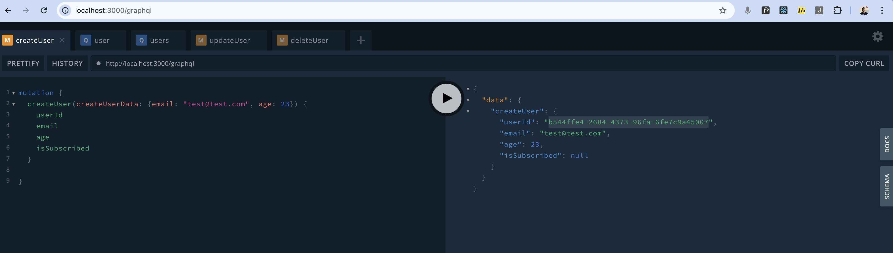
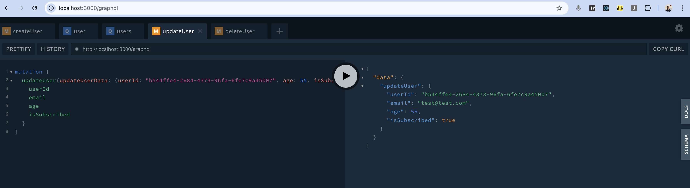
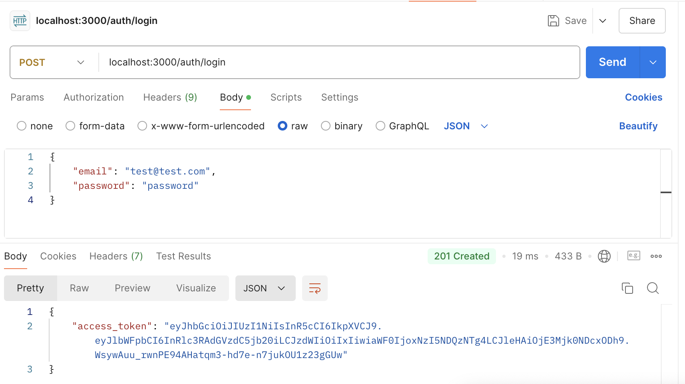
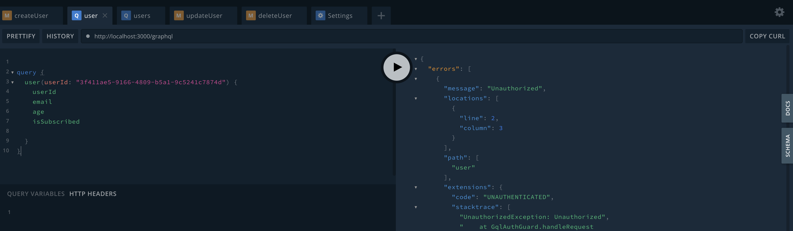
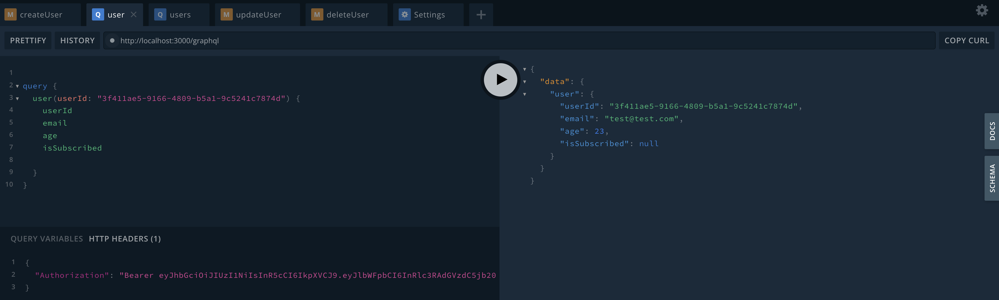

# mobx-graphql-nest-auth-kit

## Overview

`mobx-graphql-nest-auth-kit` is a full-stack project template designed to streamline the development of applications using modern technologies. This kit includes a frontend and backend directory, leveraging the power of NestJS, GraphQL, Passport, TypeScript, MobX, React, and MUI/Material.

## Tech Stack

### Backend

- **NestJS**: A progressive Node.js framework for building efficient and scalable server-side applications.
- **GraphQL**: A query language for your API, providing a more efficient, powerful, and flexible alternative to REST.
- **Passport**: Middleware for authentication in Node.js applications.
- **TypeScript**: A strongly typed programming language that builds on JavaScript.
- **Testing**: Comprehensive testing setup to ensure code quality and reliability.

### Frontend

- **React**: A JavaScript library for building user interfaces.
- **MobX**: A simple, scalable state management solution.
- **MUI/Material**: A popular React UI framework with a comprehensive set of components.
- **TypeScript**: A strongly typed programming language that builds on JavaScript.

## Project Structure

```
mobx-graphql-nest-auth-kit/
├── backend/
│   ├── src/
│   ├── test/
│   ├── nest-cli.json
│   ├── tsconfig.json
│   └── package.json
└── frontend/
  ├── src/
  ├── public/
  ├── tsconfig.json
  └── package.json
```

## Getting Started

### Prerequisites

- Node.js
- npm or yarn

### Installation

1. Clone the repository:

```sh
git clone https://github.com/anjola-adeuyi/mobx-graphql-nest-auth-kit.git
cd mobx-graphql-nest-auth-kit
```

2. Install dependencies for both frontend and backend:

```sh
cd backend
yarn install
cd ../frontend
yarn install
```

### Running the Application

1. Start the backend server:

```sh
cd backend
yarn start:dev
```

2. Start the frontend development server:

```sh
cd frontend
yarn start
```

## GraphQL Query

Visit http://localhost:3000/graphql

### Create User

```
mutation {
  createUser(createUserData: {email: "test@test.com", age: 23}) {
    userId
    email
    age
    isSubscribed
  }

}
```

### Get User

```
query {
  user(userId: "787858a1-6e00-4fea-84df-ad4cf6ecadfc") {
    userId
    email
    age
    isSubscribed

  }
}
```

### Get Users

```
query {
  users(userIds: ["787858a1-6e00-4fea-84df-ad4cf6ecadfc"]) {
    userId
    email
    age
    isSubscribed

  }
}
```

### Update User

```
mutation {
  updateUser(updateUserData: {userId: "787858a1-6e00-4fea-84df-ad4cf6ecadfc", age: 55, isSubscribed: true}) {
    userId
    email
    age
    isSubscribed
  }
}
```

### Delete User

```
mutation {
  deleteUser(deleteUserData: { userId: "787858a1-6e00-4fea-84df-ad4cf6ecadfc"}) {
    userId
    email
    age
    isSubscribed
  }
}
```

## Screenshots

Here are some screenshots of the project:

### Create User Mutation



### Update User Mutation



### Postman Auth Login



### GraphQL When queried UnAuthorized



### GraphQL with Authorization Header



## Contributing

Contributions are welcome! Please open an issue or submit a pull request.

## License

This project is licensed under the MIT License.
